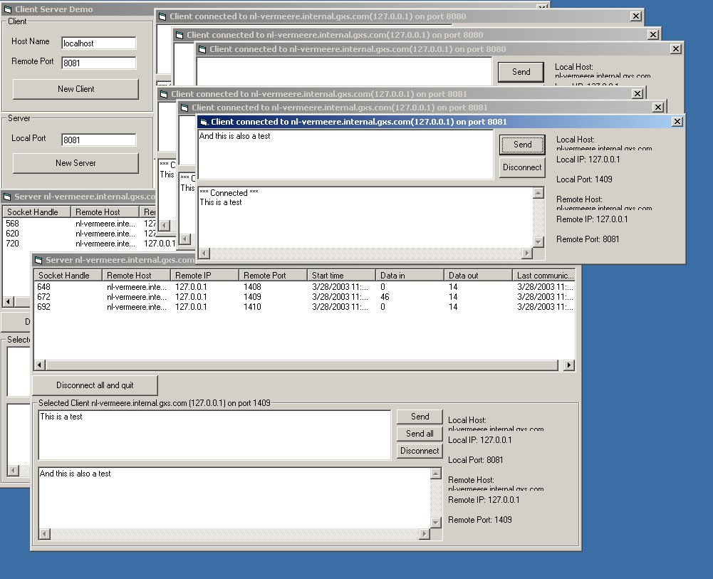



## Generic object oriented client server library

### Description

The GenericClient object can be used to create any sort of client application

and the GenericServer object can be used to create any sort of server application.

This is an API only winsock wrapper setup as an active X dll. It will hide the difficulties

in the Winsock for you and it stimulate developing in an object oriented way.

You will probably write your own protocol handler (like SMTP, POP or ...) using the OnDataArive event.

The bennefit of this library is that it uses very litle memory (compared to the inet control),

it's very fast, you do not need a form and its very easy to create multiple instances.

I tested it with 4 servers and 400 clients on 1 machine.

- - - - - - - - - - - - - - - - - - - - - - -

A demo is included that show you how to make a simple chat application.

Also a demo is available that shows you how to do port mapping.

If you want more samples, then have a look at tha SMTP and POP library at http://www.evict.nl/open_source.asp

- - - - - - - - - - - - - - - - - - - - - - -

Credits:

The (super) SubClass code is from a publication from Paul Canton [Paul_Caton@hotmail.com]. http://www.planet-source-code.com/vb/scripts/ShowCode.asp?txtCodeId=42918&amp;lngWId=1

The winsock stuff is inspired by a publication from 'Coding Genius'. http://www.planet-source-code.com/vb/scripts/showcode.asp?txtCodeId=39858&amp;lngWId=1

The Exception hanler is based on a publication from Thushan Fernando. http://www.planet-source-code.com/vb/scripts/ShowCode.asp?txtCodeId=41471&amp;lngWId=1

Earlier this week I posted a complete demo for this exception hadler. It can be found here: http://www.planet-source-code.com/vb/scripts/ShowCode.asp?txtCodeId=62771&amp;lngWId=1

- - - - - - - - - - - - - - - - - - - - - - -

2 years ago I posted an earlier version of this code here to PSC. This submition has some bug fixes, a lot of improvements for stimulating object oriented programming and there is a portmapper demo added.
 
### More Info
 

             |
---                |---
**Submitted On**   |2005-09-30 00:23:02
**By**             |[Edwin Vermeer\.](https://github.com/Planet-Source-Code/PSCIndex/blob/master/ByAuthor/edwin-vermeer.md)
**Level**          |Intermediate
**User Rating**    |5.0 (25 globes from 5 users)
**Compatibility**  |VB 6\.0
**Category**       |[Libraries](https://github.com/Planet-Source-Code/PSCIndex/blob/master/ByCategory/libraries__1-49.md)
**World**          |[Visual Basic](https://github.com/Planet-Source-Code/PSCIndex/blob/master/ByWorld/visual-basic.md)
**Archive File**   |[Generic\_ob1938061062005\.zip](https://github.com/Planet-Source-Code/edwin-vermeer-generic-object-oriented-client-server-library__1-62794/archive/master.zip)

